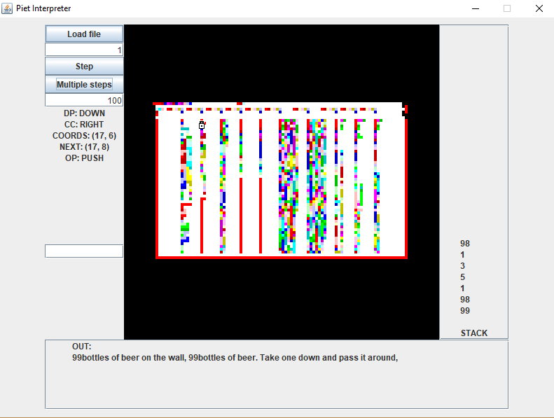

# Piet interpreter

An graphical interpreter of [Piet esoteric programming language](http://www.dangermouse.net/esoteric/piet.html). 
Created as an assignment for Scala programming course at AGH University of Science of Technology.

_(example: 99 bottles of beer by [Eddy Ferreira](http://www.dangermouse.net/esoteric/piet/samples.html))_

## Features

* Loading an image file (custom codel size supported)
* Single and multiple steps execution
* Next step prediction (useful for debugging, should you ever want to do it in Piet)
* Stack preview
* Input and output

## Authors

[mackoo13](https://github.com/mackoo13)

[Creamson](https://github.com/Creamson)
